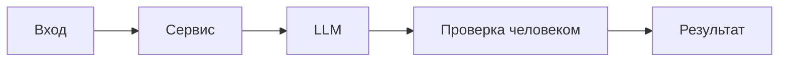

# ADR: решение для первого рабочего сценария

- Статус: accepted
- Дата: 2026-09-05
- Ответственные: команда разработки

## Контекст

Нужен помощник ревьюера PR, который по diff возвращает структурированный результат и проверяемые риски, соблюдая SEC-1, API-1, REL-1, OUT-1, SCOPE-1, QA-1, OBS-1.

## Решение

В сервисе реализовать обработку входа: фильтрацию секретов, ограничение длины diff (413 при превышении), вызов LLM с таймаутом 10с и формировать ответ строго по OUT-1: summary, ≤3 risks с file/line/evidence/risk, checks. Решение принимает человек.

## Рассмотренные альтернативы

| Альтернатива | Почему не выбрали сейчас |
|---|---|
| Свободный формат ответа | Непроверяемо и неадресно, не проходит критерии |
| Полная автоматизация ревью | Противоречит SCOPE-1, повышает риски |

## Последствия и главный риск

- Положительные последствия:
  - Проверяемость выводов, воспроизводимые проверки, улучшение качества ревью.
- Ограничения:
  - Не автоматизируем действия в GitHub; ограничены контекстом diff.
- Главный риск:
  - Ложно положительные/отрицательные риски при недостаточном контексте.
- Как проверим риск:
  - E2E и интеграционные тесты на SEC-1, API-1, REL-1; peer review и метрики evidence.

## Архитектурная схема

## Как использовали AI

- Для чего: зафиксировать минимальную архитектуру и компромиссы.
- Тип промпта: master prompt (P1-02).
- Строка в [`prompts.md`](prompts.md): P1-02.
- Что проверили и исправили сами: минимизировали решение под OUT-1/SEC-1/API-1/REL-1, убрали лишние предположения.
