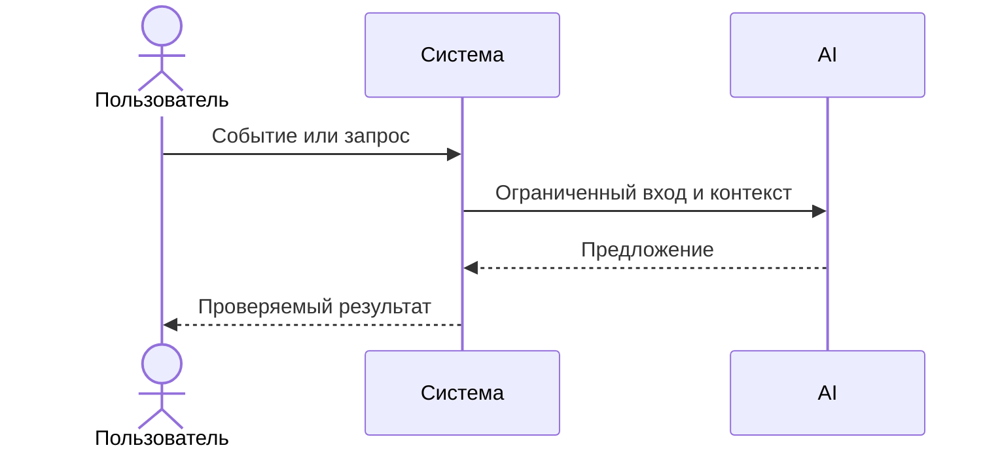

# Use cases и user stories

## Первый рабочий сценарий

**Когда** ревьюер отправляет diff на анализ, **система** обрабатывает его по правилам (SEC-1, API-1, REL-1, OUT-1) и формирует structured ответ, **а пользователь получает** summary, до 3 рисков с evidence и checks.

Не входит в этот сценарий:

- автоматический merge/approve; изменение кода; действия в GitHub.

## Use case

| Поле | Значение |
|---|---|
| Актор | Ревьюер |
| Триггер | Поступил diff PR на проверку |
| Предусловия | Длина diff ≤ 20000 символов или корректная обработка 413 |
| Основной результат | OUT-1: summary, до 3 risks с file/line/evidence/risk, checks |
| Ошибка или отказ | HTTP 413 при длинном diff; контролируемый ответ при таймауте LLM |



## User stories и acceptance criteria

```gherkin
Feature:

  Scenario: Позитивный
    Given корректный diff длиной < 20000 символов
    When ревьюер отправляет его на /api/reviews
    Then сервис возвращает структуру OUT-1: summary, ≤3 risks с evidence и checks

  Scenario: Негативный или граничный
    Given diff длиной > 20000 символов
    When ревьюер отправляет его на /api/reviews
    Then сервис возвращает HTTP 413 согласно API-1
```

## Как использовали AI

- Для чего: структурировать сценарий, user stories и acceptance criteria по правилам OUT-1/SEC-1/API-1/REL-1.
- Тип промпта: master prompt (P1-02).
- Строка в [`prompts.md`](prompts.md): P1-02.
- Что проверили и исправили сами: уточнили границы SCOPE-1, свели gherkin к проверяемым критериям, убрали лишние допущения.
