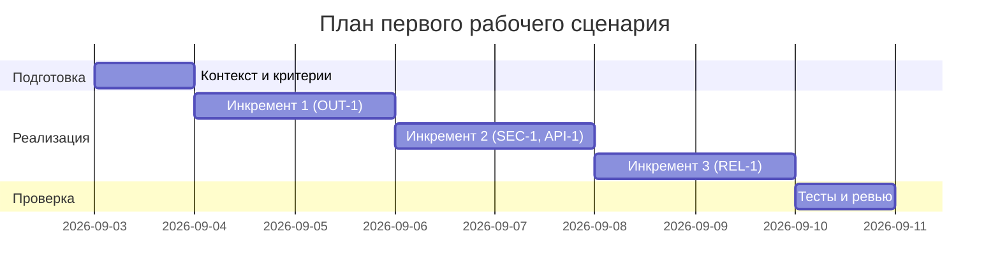

# План поставки

## Инкременты и ответственность

| Инкремент | Наблюдаемый результат | Что делает человек | Что делает AI или субагент | Проверка | Зависимости |
|---|---|---|---|---|---|
| 1 | Структура OUT-1 в ответе | Уточняет требования и формат | Формирует summary/risks/checks | Unit: проверка формата | CASE.md |
| 2 | Фильтрация секретов и 413 | Определяет правила и кейсы | Анализирует diff, редактирует секреты, отклоняет длинные diff | Integration: SEC-1, API-1 | Инкр. 1 |
| 3 | Таймаут и контролируемый ответ | Настраивает таймаут, обработку ошибок | Возвращает контролируемый ответ при таймауте | Integration: REL-1 | Инкр. 2 |

## Диаграмма Ганта

Даты и продолжительности указаны для первого рабочего сценария и могут корректироваться по итогам ревью.

## Как использовали AI

- Для чего: собрать краткий план инкрементов и проверки под CASE.md.
- Тип промпта: master prompt (P1-02).
- Строка в [`prompts.md`](prompts.md): P1-02.
- Что проверили и исправили сами: сузили объём до первого рабочего сценария, проверили соответствие OUT-1/SEC-1/API-1/REL-1.
